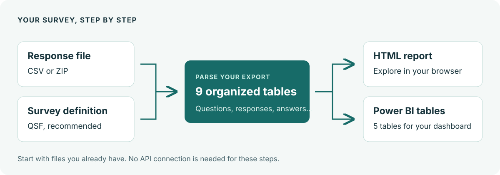

# Make sense of your survey exports

Use this toolkit to turn a Qualtrics response file into organized tables and an interactive report. Start with a CSV you already have, or download responses through the Qualtrics API.

You can follow the guides by copying a few commands. You do not need to write Python. If someone has already sent you a report, [start with reading a report](guides/reports.md#read-the-report).

[Create your first report](getting-started/first-report.md){ .md-button .md-button--primary }
[Parse a CSV again](guides/parse-exports.md){ .md-button }

## Choose your next step

-   **Try it with example data**

    Install the toolkit, use a small practice survey, and open your first report.

    [Start the tutorial](getting-started/first-report.md)

-   **Work with your own export**

    Parse a CSV or ZIP, add a survey definition, and choose where to save the result.

    [Parse an export](guides/parse-exports.md)

-   **Understand the results**

    Learn why you get ten tables and why one response can produce several answer rows.

    [Understand your data](understand/your-data.md)

-   **Prepare a dashboard**

    Export six tables for Power BI and connect them with the right relationships.

    [Build a Power BI model](guides/power-bi.md)

## From export to report

Keep the response file and its matching survey definition together. The response file contains people's answers; the definition describes the questions and allowed choices. After parsing, you can create a report, combine surveys, or prepare a dashboard.

The example survey uses invented responses. You can complete the [first-report tutorial](getting-started/first-report.md) without a Qualtrics account or API token.

## Find a specific answer

| I want to… | Go to |
| --- | --- |
| Set up the toolkit on my computer | [Installation](getting-started/installation.md) |
| Read or share a report | [Reports](guides/reports.md) |
| Bring several surveys together | [Combine surveys](guides/combine-surveys.md) |
| Download responses from Qualtrics | [API access](guides/api-access.md) |
| Look up a command or option | [CLI reference](reference/cli.md) |
| Use the toolkit from Python | [Python reference](reference/python.md) |
| Fix an error | [Troubleshooting](help/troubleshooting.md) |

This is the documentation for the [Qualtrics Python toolkit](https://github.com/Luanee/qualtrics). For your organization's Qualtrics account, survey editor, or permissions, use your organization's support channel or the [official Qualtrics help](https://www.qualtrics.com/support/).
