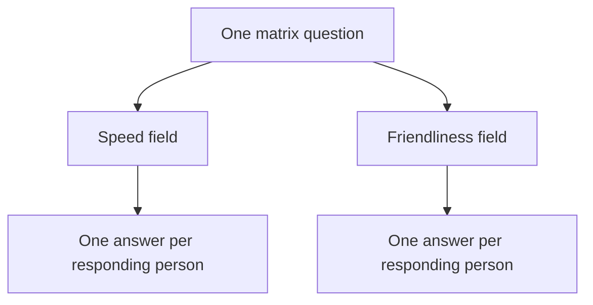

# Understand your data

A survey export puts many kinds of information in one wide file. After parsing, you get ten tables that separate survey structure, submitted responses, and answers. The toolkit calls these tables **entities**.

You can open the CSV versions in a spreadsheet. The [report](../guides/reports.md) provides a browser view if you prefer to explore the results without opening individual files.

## Follow one example

The [practice survey](../getting-started/first-report.md) asks two questions:

1. **How was your visit?** Choose Satisfied, Neutral, or Dissatisfied.
2. **What could we improve?** Write a comment.

Three people respond. All three answer the first question, and two leave a comment. You therefore get **three response rows and five answer rows**. The blank comment does not create an answer row.

Two people select Satisfied and one selects Dissatisfied. The answer-options table still includes Neutral because the survey definition lists it as an allowed choice.

## The ten tables

These are the row counts for the practice survey, not a limit on your own exports.

| Table | One row represents | Example rows |
| --- | --- | ---: |
| `surveys` | A survey | 1 |
| `sections` | A survey block | 1 |
| `questions` | A question in a survey | 2 |
| `question_fields` | An exported question column | 2 |
| `answer_options` | An allowed choice for a question field | 3 |
| `responses` | A submitted response | 3 |
| `response_answers` | A non-empty answer in a response field | 5 |
| `comments` | A nonblank text answer copied from the answer table | 2 |
| `question_catalog` | A question meaning shared across surveys | 2 |
| `question_field_catalog` | A field meaning shared across surveys | 2 |

[Download this table guide as CSV](../assets/examples/table-guide.csv).

The two catalog tables help you compare matching question and field meanings across surveys. Most readers can start with `surveys`, `questions`, `responses`, and `response_answers` and use the catalogs when they need comparisons.

## Comments are an answer subset

`comments` makes written answers easier to use in a spreadsheet or Power BI. In the practice survey, its two rows are the same two comments already counted among the five answer rows. There are still five answers in total. Keep `response_answers` for all-answer counts and use `comments` when you want to work only with text.

Each comment keeps its original `response_answer_id`, response, question, field, and unchanged text. Matching words do not merge records: if two people both write “Good service”, you get two rows. If one person fills two text boxes, you also get two rows. Language comes from that response's `user_language`; a missing code stays blank. It is not the survey's default language or a detected language of the comment.

The table includes supported text fields, including form and matrix text and an “Other” text box attached to a choice. It excludes choice labels, numeric fields, response properties, and whitespace-only text. Missing or unsupported source metadata can limit which fields are recognized. The report's **Written answers** view follows the same rule. See the [comments contract](../entity-model.md#comments) for classification details.

The original nine tables remain authoritative. Older folders without a comments file still load; the toolkit reconstructs the subset from their available metadata.

## A question can have several fields

Think of a **question** as the prompt a person sees. A **field** is a column in the exported file.

A question such as “Rate the speed and friendliness of your visit” can have one field for speed and another for friendliness. A multiple-choice question can have a field for each selection. A text box attached to a choice has its own field too.

In this example, a person who rates both speed and friendliness contributes two answer rows to one question. Keep the fields separate when comparing results.

## The definition fills in the context

With a matching QSF definition, you can keep the survey's name, question types, blocks, and allowed choices. The toolkit builds answer options from that definition, including choices nobody selected.

Without a definition, you can still parse the export, but some metadata and type information will be missing. You will not get a reliable list of allowed answer options by looking only at the responses. See [parsing with a definition](../guides/parse-exports.md).

## Answers and response properties

Response properties belong to the whole submission. They are additional columns on `responses`; there is no separate property-value table. Question answers stay in `response_answers`.

For example, these fictional submissions carry an embedded department and country:

| response_external_id | recorded_at | Department | Country | Email_permission |
| --- | --- | --- | --- | --- |
| R_1 | 2026-09-01 09:00:00 | Sales | DE | Yes |
| R_2 | 2026-09-01 09:05:00 | Engineering | GB | No |

Their answers to “How satisfied are you?” remain separate:

| response_external_id | question_external_id | answer_text |
| --- | --- | --- |
| R_1 | QID1 | Satisfied |
| R_2 | QID1 | Neutral |

The parser uses CSV identifiers and the matching definition to decide where a field belongs. A question asking “Which country do you work in?” remains a question answer, even when its export column is named `Country`. A `Country` field declared as embedded data in the survey flow is a response property. Permission questions and embedded permission flags are distinguished the same way.

Standard fields use established names such as `StartDate` → `started_at`, `RecordedDate` → `recorded_at`, and `IPAddress` → `ip_address`. Custom fields normally keep their source names, including `Region`, `Country`, or `distr_ch`. Unknown columns are retained as **Unclassified** properties so you can inspect them without treating them as confirmed question answers. The [codebook](../guides/reports.md#look-up-exported-columns-in-the-codebook) shows the evidence and storage column for each source field.

Custom values remain text or null: a code such as `001` keeps its leading zeros. The parser copies observed CSV values; it does not fill response properties from defaults or hypothetical assignments in the survey flow.

## Read missing values carefully

- A blank source answer creates no `response_answers` row. It may reflect a skipped question, survey routing, or an optional answer. The absence alone does not explain why.
- An answer can retain its original text while its option ID is empty. The toolkit could not match it to one allowed choice with confidence.
- A numeric-looking category code is still a choice code. Do not average it unless the survey's scale and your analysis justify that calculation.
- The number of responses is not necessarily the number of unique people. One person may submit more than once.

## Choose a file format

| Format | Use it for | What to expect |
| --- | --- | --- |
| CSV | Opening tables in a spreadsheet or sharing with analysts | One text file per table; spreadsheet apps may infer dates or numbers differently |
| JSON | Inspecting records or writing a script | Readable records with field names; the default for `qualtrics build` |
| Parquet | Data pipelines and larger analytical tables | Typed column data; requires the Parquet extra |

Keep one format per entity folder. To switch formats, choose a new output folder so the loader does not find two versions of the same table.

For exact column names, IDs, and relationships, read the [entity-model contract](../entity-model.md). For dashboard tables, follow [the Power BI guide](../guides/power-bi.md).
